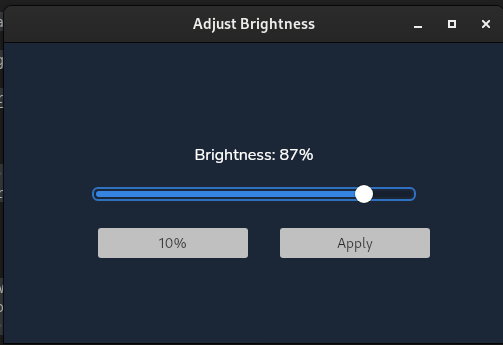

# README

# extmb

This is a simple GUI application that let you control yor external monitor brightness. It uses ddcutil to adjust brightness.

## About

This is the official Wails Vue-TS template.

You can configure the project by editing `wails.json`. More information about the project settings can be found
here: https://wails.io/docs/reference/project-config

**Built with:**

* **Go:** The programming language used to build the application's backend.
* **Wails:** A framework for building cross-platform desktop applications using Go and Web Technologies (HTML, CSS, JavaScript).
* **ddcutil** You can download it here https://www.ddcutil.com/

**Prerequisites:**

* **Go:** Install Go from the official website: [link to Go website]
* **ddcutil:** A command-line utility for controlling display settings. Install it using your system's package manager (e.g., `apt-get install ddcutil` on Debian/Ubuntu).
* 

**How to use:**

* intall nodejs (if you don't have it installed)
* install wails (https://wails.io/docs/gettingstarted/installation/)
* install ddcutil (https://www.ddcutil.com/)
* Clone this repo
* Follow the guidelines from wails docs to start the app in dev enviroment and how to build it.

## Live Development

To run in live development mode, run `wails dev` in the project directory. This will run a Vite development
server that will provide very fast hot reload of your frontend changes. If you want to develop in a browser
and have access to your Go methods, there is also a dev server that runs on http://localhost:34115. Connect
to this in your browser, and you can call your Go code from devtools.

## Building

To build a redistributable, production mode package, use `wails build`.